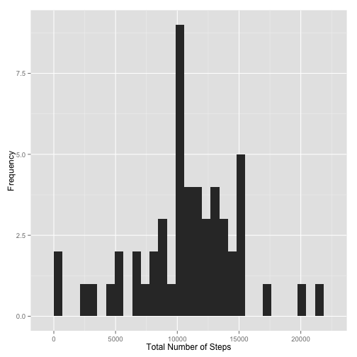
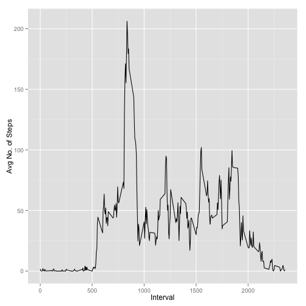
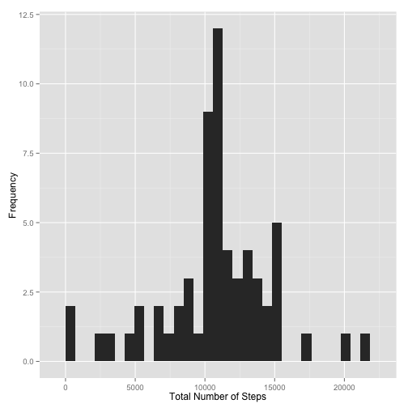
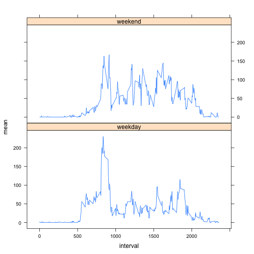

## a. Loading and preprocessing the data

Download file from https://d396qusza40orc.cloudfront.net/repdata%2Fdata%2Factivity.zip

Make sure "activity.csv" is in the working directory.

### 1. Load the data


```r
library(data.table)
myData <- read.table("activity.csv", header=TRUE, na.strings="NA", sep=',')
```

Convert Date into a date variable:

```r
myData$date <- as.Date(myData$date, format="%Y-%m-%d")
```

Verify that variables are in the right format:

```r
str(myData)
```

```
## 'data.frame':	17568 obs. of  3 variables:
##  $ steps   : int  NA NA NA NA NA NA NA NA NA NA ...
##  $ date    : Date, format: "2012-10-01" "2012-10-01" ...
##  $ interval: int  0 5 10 15 20 25 30 35 40 45 ...
```

## b. What is mean total number of steps taken per day?

Remove NA values:

```r
myData2 <- na.omit(myData)
```

### 1. Calculate the total number of steps taken per day

```r
sum.date <- aggregate(myData2[,1],by=list(myData2$date),sum)
names(sum.date) <- c("date","total_steps")
head(sum.date)
```

```
##         date total_steps
## 1 2012-10-02         126
## 2 2012-10-03       11352
## 3 2012-10-04       12116
## 4 2012-10-05       13294
## 5 2012-10-06       15420
## 6 2012-10-07       11015
```

### 2. Make a histogram of the total number of steps taken each day
Load graphics packages "ggplot2" and plot.

```r
library(ggplot2)
qplot(x=total_steps, data=sum.date) + labs(y='Frequency', x='Total Number of Steps')
```

```
## stat_bin: binwidth defaulted to range/30. Use 'binwidth = x' to adjust this.
```

 

### 3. Calculate and report the mean and median of the total number of steps taken per day


```r
summary(sum.date$total_steps)
```

```
##    Min. 1st Qu.  Median    Mean 3rd Qu.    Max. 
##      41    8841   10760   10770   13290   21190
```

Mean = 10770 steps per day, Median = 10760 steps per day

## c. What is the average daily activity pattern?

### 1. Make a time series plot (i.e. type = "l") of the 5-minute interval (x-axis) and the average number of steps taken, averaged across all days (y-axis)


```r
avg_per_interval <- aggregate(myData2[,1], by=list(myData2$interval),mean)
names(avg_per_interval) <- c("interval", "mean")
qplot(interval, mean, data=avg_per_interval, geom="line", stat="identity",xlab="Interval", ylab="Avg No. of Steps")
```

 

### 2. Which 5-minute interval, on average across all the days in the dataset, contains the maximum number of steps?


```r
max <- max(avg_per_interval$mean)
avg_per_interval[avg_per_interval$mean == max,]$interval
```

```
## [1] 835
```

Interval 835, averaged over all days, contains the maximum number of steps (206.1698113 steps).

## d. Imputing missing values

### 1. Calculate and report the total number of missing values in the dataset (i.e. the total number of rows with NAs)


```r
sum(is.na(myData))
```

```
## [1] 2304
```

Total number of missing values is 2304.

### 2. Devise a strategy for filling in all of the missing values in the dataset. The strategy does not need to be sophisticated. For example, you could use the mean/median for that day, or the mean for that 5-minute interval, etc.

Replace missing values with the mean for each particular 5-minute interval.

### 3. Create a new dataset that is equal to the original dataset but with the missing data filled in.

Represent the new dataset by "myData3".

Create a new column representing the mean for each interval averaged across all days:

```r
myData3 <- merge(myData, avg_per_interval, by.x = "interval", by.y = "interval")
myData3 <- myData3[order(myData3[,3],myData3[,1]),]
myData3 <- subset(myData3[,c(2,3,1,4)])
myData3$date <- as.Date(myData3$date, format="%Y-%m-%d")
head(myData3)
```

```
##     steps       date interval      mean
## 1      NA 2012-10-01        0 1.7169811
## 63     NA 2012-10-01        5 0.3396226
## 128    NA 2012-10-01       10 0.1320755
## 205    NA 2012-10-01       15 0.1509434
## 264    NA 2012-10-01       20 0.0754717
## 327    NA 2012-10-01       25 2.0943396
```

Replace missing values with mean value for each interval:

```r
#create index of all cells with missing values
ind <- which(is.na(myData), arr.ind=TRUE)
#replace missing values for index
myData3[ind] <- myData3[,4]
```

```
## Warning in `[<-.data.frame`(`*tmp*`, ind, value = c(1.71698113207547,
## 0.339622641509434, : number of items to replace is not a multiple of
## replacement length
```

```r
head(myData3)
```

```
##         steps       date interval      mean
## 1   1.7169811 2012-10-01        0 1.7169811
## 63  0.3396226 2012-10-01        5 0.3396226
## 128 0.1320755 2012-10-01       10 0.1320755
## 205 0.1509434 2012-10-01       15 0.1509434
## 264 0.0754717 2012-10-01       20 0.0754717
## 327 2.0943396 2012-10-01       25 2.0943396
```

### 4. Make a histogram of the total number of steps taken each day and Calculate and report the mean and median total number of steps taken per day. Do these values differ from the estimates from the first part of the assignment? What is the impact of imputing missing data on the estimates of the total daily number of steps?

Create a new data frame "sum.date2" representing the total number of steps taken for each day:

```r
sum.date2 <- aggregate(myData3[,1],by=list(myData3$date),sum)
names(sum.date2) <- c("date","total_steps")
head(sum.date2)
```

```
##         date total_steps
## 1 2012-10-01    10766.19
## 2 2012-10-02      126.00
## 3 2012-10-03    11352.00
## 4 2012-10-04    12116.00
## 5 2012-10-05    13294.00
## 6 2012-10-06    15420.00
```

Plot histogram:

```r
library(ggplot2)
qplot(x=total_steps, data=sum.date2) + labs(y='Frequency', x='Total Number of Steps')
```

```
## stat_bin: binwidth defaulted to range/30. Use 'binwidth = x' to adjust this.
```

 


```r
summary(sum.date2$total_steps)
```

```
##    Min. 1st Qu.  Median    Mean 3rd Qu.    Max. 
##      41    9819   10770   10770   12810   21190
```

Mean = 10770 steps per day, Median = 10770 steps per day

There is little change in the mean and median even after inputing the missing values.

## e. Are there differences in activity patterns between weekdays and weekends?

### 1. Create a new factor variable in the dataset with two levels – “weekday” and “weekend” indicating whether a given date is a weekday or weekend day.


```r
myData3$day <- weekdays(myData3$date)
myData3$weekday_weekend[myData3$day == "Saturday" | myData3$day == "Sunday"] <- "weekend" 
myData3$weekday_weekend[myData3$day != "Saturday" & myData3$day != "Sunday"] <- "weekday" 
myData3$weekday_weekend <- as.factor(myData3$weekday_weekend)
#Sample of result
rbind(myData3[1,],myData3[1500,])
```

```
##         steps       date interval     mean      day weekday_weekend
## 1    1.716981 2012-10-01        0 1.716981   Monday         weekday
## 3603 0.000000 2012-10-06      455 1.113208 Saturday         weekend
```

### 2. Make a panel plot containing a time series plot (i.e. type = "l") of the 5-minute interval (x-axis) and the average number of steps taken, averaged across all weekday days or weekend days (y-axis). See the README file in the GitHub repository to see an example of what this plot should look like using simulated data.

Create new data frame "avg_weekday_weekend" for the average number of steps taken, averaged across all weekday days or weekend days.

Use "plyr" package.

```r
library(plyr)
avg_weekday_weekend <- ddply(myData3, .(interval, weekday_weekend), summarize, mean = round(mean(steps), 3))
avg_weekday_weekend <- avg_weekday_weekend[order(avg_weekday_weekend[,2],avg_weekday_weekend[,1]),]
head(avg_weekday_weekend)
```

```
##    interval weekday_weekend  mean
## 1         0         weekday 2.251
## 3         5         weekday 0.445
## 5        10         weekday 0.173
## 7        15         weekday 0.198
## 9        20         weekday 0.099
## 11       25         weekday 1.590
```

```r
tail(avg_weekday_weekend)
```

```
##     interval weekday_weekend   mean
## 566     2330         weekend  1.388
## 568     2335         weekend 11.587
## 570     2340         weekend  6.288
## 572     2345         weekend  1.705
## 574     2350         weekend  0.028
## 576     2355         weekend  0.134
```

Use "lattice" package to plot line graph.

```r
library(lattice)
xyplot(mean ~ interval | weekday_weekend, type = "l", data=avg_weekday_weekend,layout=c(1,2))
```

 

As shown from the graph, excluding the mornings between around 0500 and 1000, the evenings between around 1700 and 2000 and the approximate sleeping hours, the weekends record a larger number of steps than weekdays on average.
